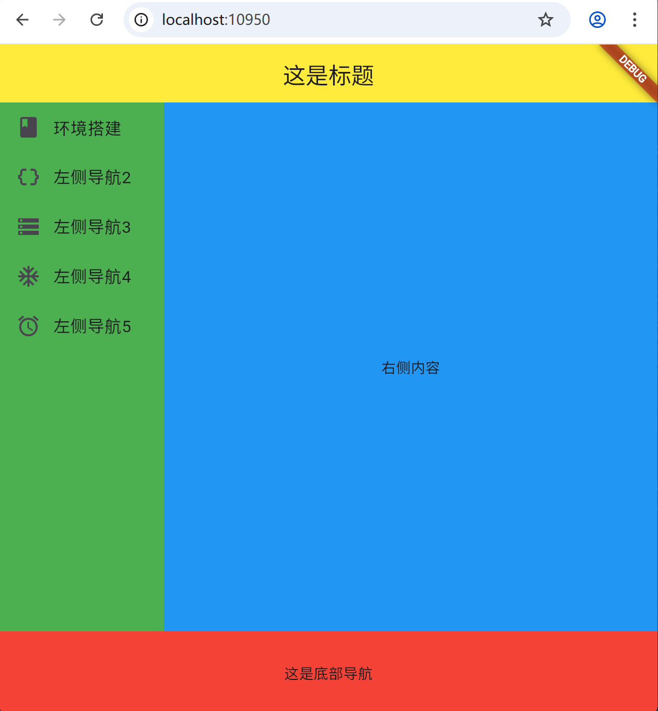

# Day 9 详细学习计划：Dart 基础与 Flutter 布局

## 学习目标
- 学习 Dart 语言基础知识
- 理解 Flutter 布局系统
- 创建上下左右布局结构，大概就是下面的效果  


## 知识点详解

### 1. Dart 语言基础
**核心概念：**
- 变量声明（var, final, const）
- 数据类型（int, double, String, bool, List, Map）
- 函数定义和调用
- 类和对象

### 2. Flutter 布局系统
**核心 Widgets：**
- Container：多功能容器
- Row：水平排列子元素
- Column：垂直排列子元素
- ListView：可滚动列表
- Expanded 和 Flexible：弹性布局

### 3. Widget 树概念
**重要性：**
- Flutter UI 由 Widget 构成
- Widget 是不可变的
- 通过组合构建复杂界面
- 父 Widget 控制子 Widget 的布局和行为

## 练习代码

### 1. Dart 基础语法

#### 变量和类型
```dart
// 变量声明
var name = '张三';
String title = 'Flutter 教程';
int count = 10;
double price = 99.99;
bool isPublished = true;

// Final 和 Const
final DateTime now = DateTime.now();  // 运行时常量
const double pi = 3.14159;            // 编译时常量

// 集合类型
List<String> topics = ['环境搭建', '数据模型', '数据库'];
Map<String, dynamic> article = {
  'title': 'Dart 基础',
  'author': '教程作者',
  'views': 1000,
};
```

#### 函数定义
```dart
// 基本函数
int add(int a, int b) {
  return a + b;
}

// 箭头函数（简洁语法）
int multiply(int a, int b) => a * b;

// 可选参数
String greet(String name, {String? title}) {
  if (title != null) {
    return 'Hello, $title $name!';
  }
  return 'Hello, $name!';
}

// 默认参数值
void printInfo(String name, {int age = 18}) {
  print('$name is $age years old');
}
```

#### 类和对象
```dart
class Article {
  String title;
  String content;
  String? author;
  bool published;
  
  // 构造函数
  Article(this.title, this.content, {this.author, this.published = false});
  
  // 命名构造函数
  Article.fromJson(Map<String, dynamic> json)
      : title = json['title'],
        content = json['content'],
        author = json['author'],
        published = json['published'] ?? false;
  
  // 方法
  void publish() {
    published = true;
    print('$title 已发布');
  }
  
  // Getter 和 Setter
  String get summary => content.substring(0, 50) + '...';
  
  // toString 方法
  @override
  String toString() {
    return 'Article(title: $title, author: $author, published: $published)';
  }
}
```

### 2. Flutter 创建一个简单的上下左右布局实践
使用命令创建一个flutter的web项目：
```bash
flutter create --platforms web myflutter
```
然后运行项目：
```bash
cd myflutter
flutter run
// 或者使用VSCode运行，在main方法上面有run字样点击就可以运行
```
会得到一个计数器项目，我们来修改一下：
#### 修改后的 main.dart（左右布局），修改后保存看效果
```dart
import 'package:flutter/material.dart';

// 程序入口点，main函数
void main() {
  // runApp是Flutter框架提供的顶层函数，用于启动应用程序
  runApp(
    // MaterialApp是Material Design风格的应用程序根组件
    MaterialApp(
      // 设置应用的标题
      title: "这是标题",
      // 设置应用的主题，这里设置了scaffold的背景色为红色
      theme: ThemeData(scaffoldBackgroundColor: Colors.red),
      // home属性指定应用默认显示的页面，这里是一个Scaffold组件
      home: Scaffold(
        // appBar属性定义应用栏（顶部导航栏）
        appBar: AppBar(
          // title属性设置应用栏的标题内容，使用Center居中显示文本
          title: Center(child: Text("这是标题")),
          // 添加颜色背景，设置应用栏背景色为黄色
          backgroundColor: Colors.yellow,
        ),
        // body属性定义页面的主要内容区域
        body: Row(
          // Row组件用于水平排列子组件
          children: [
            // 下面体现左侧导航栏右边的内容使用Expanded
            // Expanded组件用于在Row、Column或Flex中扩展子组件以填充可用空间
            Expanded(
              // flex属性定义了此组件相对于其他Expanded组件的弹性系数，这里占1份空间
              flex: 1,
              // Container是一个方便的容器组件，可以设置大小、颜色、边距等属性
              child: Container(
                // 设置容器背景色为绿色
                color: Colors.green,
                // ListView是一个可滚动的列表组件
                child: ListView(
                  // 子组件列表
                  children: [
                    // ListTile是Material Design中的列表项组件
                    ListTile(
                      // leading属性设置列表项前面的图标
                      leading: const Icon(Icons.book),
                      // title属性设置列表项的标题文本
                      title: const Text('环境搭建'),
                      // onTap属性定义点击列表项时的回调函数
                      onTap: () {
                        // TODO: 导航到环境搭建教程
                      },
                    ),
                    ListTile(
                      // leading属性设置列表项前面的图标
                      leading: const Icon(Icons.data_object),
                      // title属性设置列表项的标题文本
                      title: Text("左侧导航2"),
                    ),
                    ListTile(
                      // leading属性设置列表项前面的图标
                      leading: const Icon(Icons.storage),
                      // title属性设置列表项的标题文本
                      title: Text("左侧导航3"),
                    ),
                    ListTile(
                      // leading属性设置列表项前面的图标
                      leading: const Icon(Icons.ac_unit_sharp),
                      // title属性设置列表项的标题文本
                      title: Text("左侧导航4"),
                    ),
                    ListTile(
                      // leading属性设置列表项前面的图标
                      leading: const Icon(Icons.access_alarm_outlined),
                      // title属性设置列表项的标题文本
                      title: Text("左侧导航5"),
                    ),
                  ],
                ),
              ),
            ),
            // 另一个Expanded组件，flex值为3，表示占据3份空间（总共4份空间，比例为1:3）
            Expanded(
              flex: 3,
              // Container是一个方便的容器组件
              child: Container(
                // 设置容器背景色为蓝色
                color: Colors.blue,
                // Center组件将其子组件居中显示
                child: Center(child: Text("右侧内容")),
              ),
            ),
          ],
        ),
        // bottomNavigationBar属性定义底部导航栏
        bottomNavigationBar: Container(
          // 设置容器高度为80像素
          height: 80,
          // Center组件将其子组件居中显示
          child: Center(child: Text("这是底部导航")),
        ),
      ),
    ),
  );
}

```

### 3. 常用布局 Widgets

#### Container 示例
```dart
Container(
  width: 100,
  height: 100,
  margin: const EdgeInsets.all(10),
  padding: const EdgeInsets.all(8),
  decoration: BoxDecoration(
    color: Colors.blue,
    borderRadius: BorderRadius.circular(8),
  ),
  child: const Text('容器示例'),
)
```

#### Row 和 Column 示例
```dart
// 水平排列
Row(
  mainAxisAlignment: MainAxisAlignment.spaceEvenly,
  children: [
    Icon(Icons.home),
    Icon(Icons.search),
    Icon(Icons.person),
  ],
)

// 垂直排列
Column(
  mainAxisAlignment: MainAxisAlignment.center,
  children: [
    Text('第一行'),
    Text('第二行'),
    Text('第三行'),
  ],
)
```
